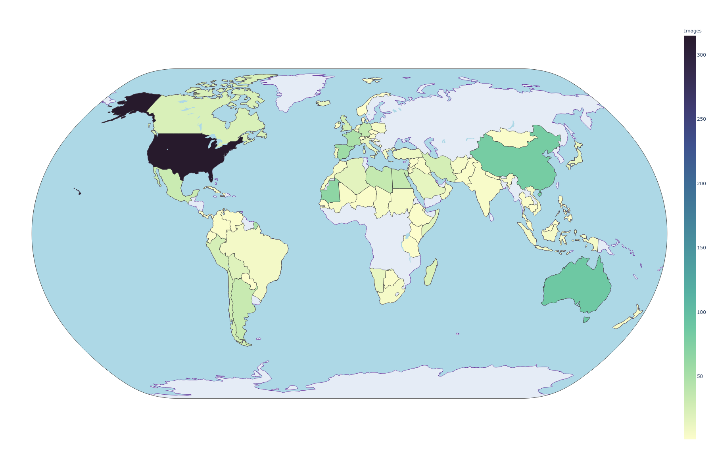
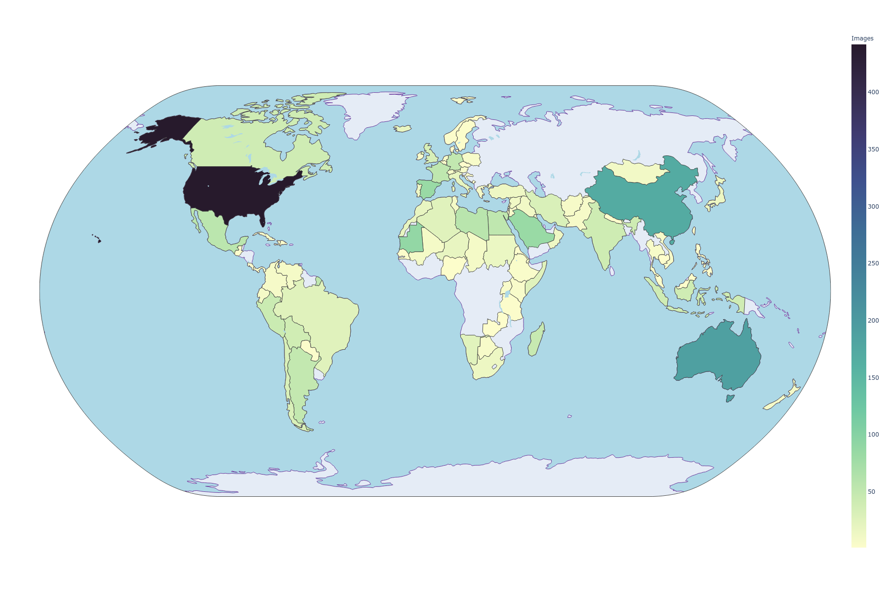
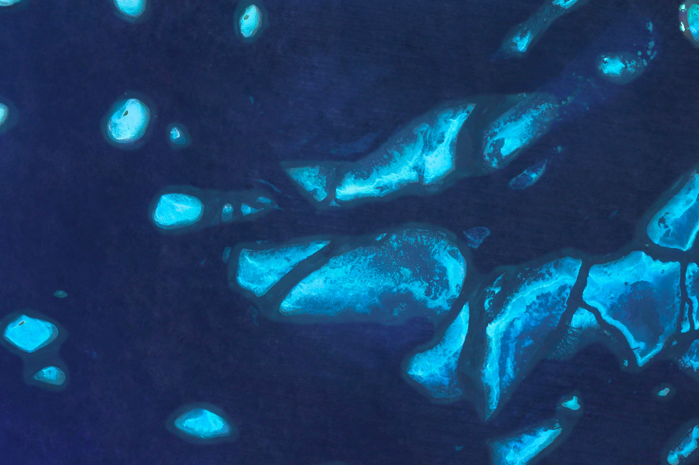
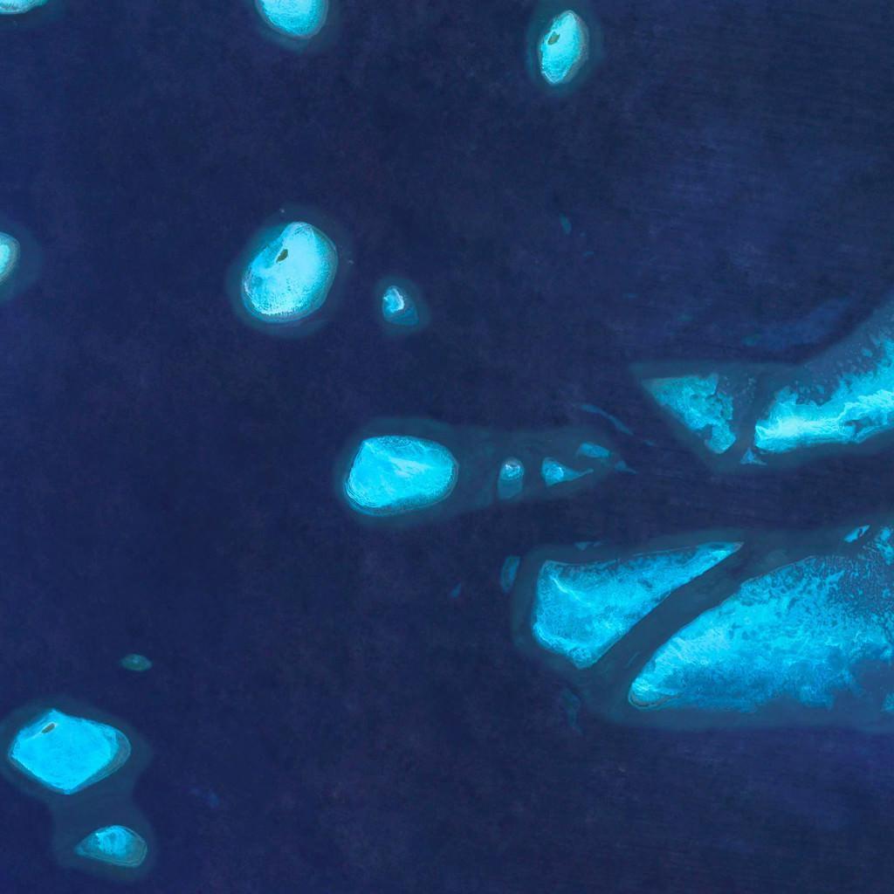
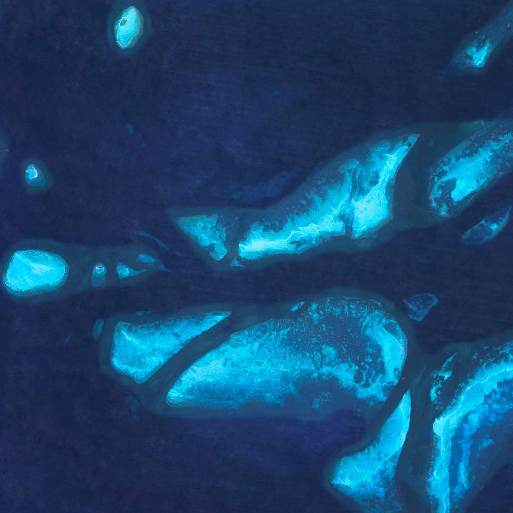
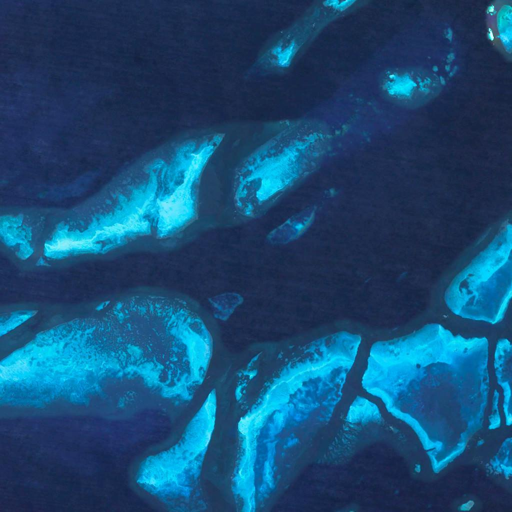
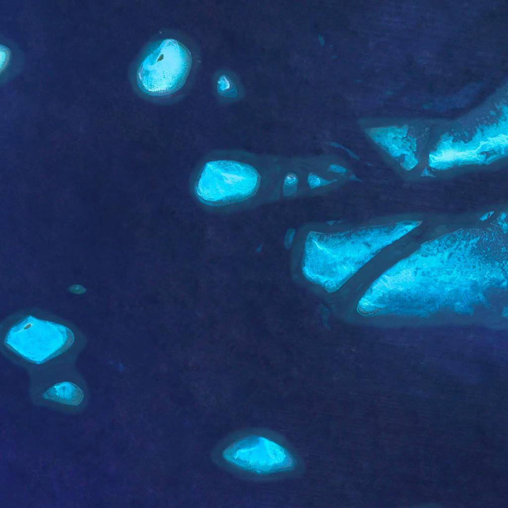
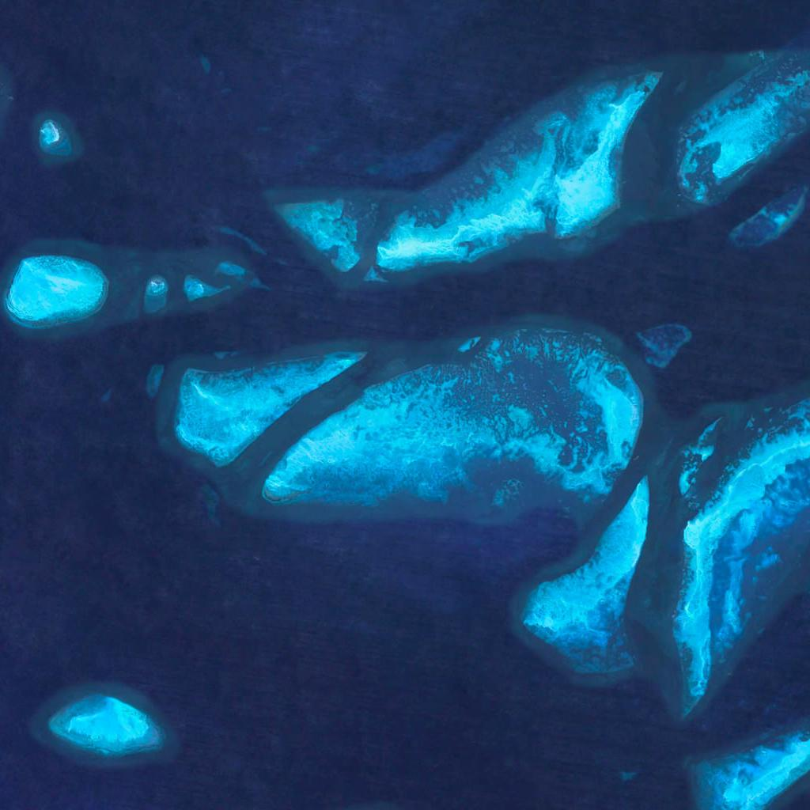
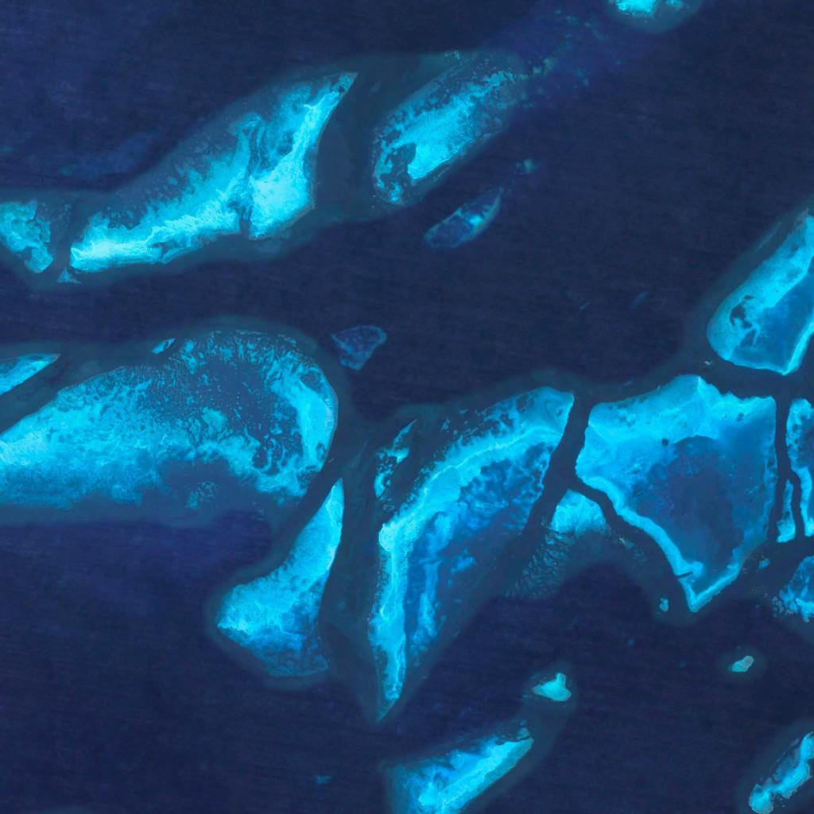

# Earth View by Google

[Google's Earth View](https://earthview.withgoogle.com) is a collection of the most beautiful and striking landscapes
found in Google Earth.

The original table in the repository and JSON files are outdated, as currently (mid-March 2021), there are **2609**
images in Earth View. For reference, when this repository was first uploaded by [Henry Lim](https://github.com/limhenry),
there were only **1511** images available (and 9 were duplicated in his original [static JSON file](https://raw.githubusercontent.com/limhenry/earthview/master/earthview.json)).

As such, the table itself won't be updated, but the JSON file will be (raw version found [here](https://raw.githubusercontent.com/PDillis/earthview/master/earthview.json)).
Likewise, the code to parse Earth View will be updated to [`Python 3.0`](https://www.python.org/download/releases/3.0/),
where the user will be able to download an updated version of the JSON file, as well as download each individual image,
crop, as well as resize them (to be used for training a [StyleGAN2-ADA](https://github.com/PDillis/stylegan2-ada-pytorch) model).

However, the code for the [wallpaper changer](https://github.com/PDillis/earthview/tree/master/wallpaper%20changer)
won't be updated, as I won't be using it (for now). I won't remove it, in case this happens in the future, or if anyone
else is interested in making the relevant updates (that is, if they are even necessary).

---

<a name='tldr'></a>
## TLDR

|File name | Description|
| :--- | :--- |
| [all_imgs_full_resolution.zip](https://docs.google.com/uc?id=16HLpnlXxF50AUqrwPAeoG619Y99vmvjy) | 2609 images at full resolution  (`1800x1200` pixels)  |
| [imgs_by_country_full_resolution.zip](https://docs.google.com/uc?id=1EFhNjd8XLgTaSAoQubNMUml_sP-BJVVW) | 2609 images at full resolution sorted by country |

---

## Requirements

To run the code, you will mainly need three packages: [`tqdm`](https://github.com/tqdm/tqdm),
[`opencv-python`](https://github.com/opencv/opencv-python), and [`click`](https://click.palletsprojects.com/en/7.x/). To
install all of them, simply run:

```commandline
pip3 install tqdm opencv-python click
```
and you should be good to go.

---

### But first: Why update the repository?
Over 1,000 new images have been added ever since Henry Lim first released the repository in April 2016. Not only that,
but new countries have been added, allowing us to truly experience the natural beauty and diversity of our planet.
Indeed, we can appreciate the change in the following plots, where the left one is the old JSON, and the right one is
the new JSON file (click for larger image):

Old JSON | New JSON
:---:|:---:
 | 

Some of the latest images that have been added to Earth View are shown here, and I believe they speak for themselves as
to why I wished to update the JSON file.

Guatemala :guatemala:


Eritrea :eritrea:


Paraguay :paraguay:


---

# Code overview

This repository code is divided into four parts:
* [x] Getting the JSON file with the image urls: [`parser.py`](#getjson)
* [x] Downloading the images to your local machine: [`download_images.py`](#download)
  * [x] Let the user divide the images into classes, specifically, countries, when downloading them.
  * [ ] **TODO:** Use these classes to generate the `dataset.json` to use in the [`dataset_tool.py`](https://github.com/PDillis/stylegan2-ada-pytorch/blob/main/dataset_tool.py)
* [x] Cropping the images to (multiple) squares, using the full image: [`data_augment.py`](#multi-crop)
* [ ] **TODO:** Cropping a rectangular image into squares and then resize them: [`data_augment.py`](#cut-crop)
* [ ] **TODO:** Resizing the cropped images to the desired size: [`data_augment.py`](#resize)

The last three steps are more relevant for the StyleGAN2-ADA model, but in the future the cropping might not be. Indeed,
a rectangular version of the model can be trained, so only downloading the images and resizing them could prove
sufficient.

We explain each part of the parsing code in the following sections.

<a name='getjson'></a>
## Get latest JSON file - `parser.py`

Before downloading the images, we must parse through the Earth View website and get all the corresponding metadata. We
will then store this in a local JSON file named `earthview.json`. ***Note that I provide in this repository the latest
JSON version available, so don't worry of using the `parser.py` code, unless you want to recheck the results.***

The command to get this file is as follows:

```commandline
python3 parser.py
```

We will use `Pool` from [`multiprocessing`](https://docs.python.org/3/library/multiprocessing.html) in order to execute
the code in a faster way. Other parameters to set via the command line are the `--save-dir`, `--processes-per-cpu`, and
`--max-index`. Their default values are, respectively, `8`, `20000`, and the current directory, `os.getcwd()`.

While it may seem like a high value for the number of parallel processes per CPU, this is not a heavy task so as to worry
for using a high value. I have noted that the higher you go, the more likely it may seem to get 'stuck', but the code is
still running and will finish in the initial estimated time (around 3 minutes when using `--processes-per-cpu=8`).

For `--max-index`, the number will depend on the latest images available in Earth View, as currently (mid-March 2021),
the last image available is [`14793`](https://www.gstatic.com/prettyearth/assets/full/14793.jpg). Since the numbering
logic on Earth View is out of my control and understanding, setting a high index should ensure you capture the latest
images available.

Use `--save-dir` to change the directory where the JSON file will be saved. Be careful of changing this, as the rest of
the code repository will rely on the `earthview.json` being saved at the current directory. As usual, use `--help` to
know more details on each parameter. `earthview.json` will have the following structure:

```json
[
    {
        "country": "Australia",
        "image": "https://www.gstatic.com/prettyearth/assets/full/1003.jpg",
        "map": "https://www.google.com/maps/@-10.040181,143.560709,11z/data=!3m1!1e3",
        "region": ""
    },
    {
        "country": "Chile",
        "image": "https://www.gstatic.com/prettyearth/assets/full/1004.jpg",
        "map": "https://www.google.com/maps/@-19.140249,-68.683995,14z/data=!3m1!1e3",
        "region": "Tamarugal"
    },
//...
]
```

This JSON file can then be loaded via Python by using [`json`](https://docs.python.org/3/library/json.html):

```python
import json

with open('earthview.json') as f:
    data = json.load(f)
```

`data` will be a `list`, where ach element will be a `dict` that has the country, image URL, Google Maps link and region
for each image (basically, the same format as the JSON file above). You can then use it to, e.g., get all the URLs of
the images like so:

```python
img_urls = [data[i]['image'] for i in range(len(data))]
```
or, in a more *'Pythonic'* way:

```python
import operator
img_urls = list(set(map(operator.itemgetter('image'), data)))
```

which is exactly what we will use to download the images in the following section.
___

<a name='download'></a>
## Downloading Images - `download_images.py`

### Download all images

Having the latest JSON file, we can then proceed to download them all to our local machine. We do this with the following:

```commandline
python3 download_images.py download-all
```

This will download all the images at full resolution (`1800x1200` pixels) and save them without grouping them by country.

If the user doesn't feel like updating the JSON file with the latest images (assuming there are more), and assuming that
there isn't a local copy of the JSON file, then the JSON file in the Github repository can be used by doing as follows:

```commandline
python3 download_images.py download-all --static-json
```

Finally, you can create a ZIP file of the full-resolution images by adding the following command (if the images have
already been downloaded, then they will be skipped, optimizing your time):

```commandline
python3 download_images.py download-all --static-json --make-zip
```

This is the first ZIP file I provide [above](#tldr).

### Download by country

On the other hand, what if you wish to download all the images, but separate them by country? This can be done with the
same JSON file we have constructed, only by using the following command:

```commandline
python3 download_images.py download-by-country
```
As before, you can both use the static JSON file found in the online Github repository, as well as ZIP the contents at
the end of downloading them all by using the following commands:

```commandline
python3 download_images.py download-by-country --static-json --make-zip
```

This is the second ZIP file I provide [above](#tldr). Note that if you have already downloaded all the images, then they
will simply be copied over, avoiding unnecessary downloading times.

___

<a name='multi-crop'></a>
## Multi-crop - `data_augment.py`

Sometimes a dataset would be better used without using center-cropping, and randomly cropping it would be a disservice.
For this I bring multi-cropping, which is essentially what was used in the [StyleGAN2-ADA](https://github.com/NVlabs/stylegan2-ada/)
repository for creating the BreCaHAD dataset. You can find their code 
[here](https://github.com/NVlabs/stylegan2-ada/blob/1ea5f6fa58108ca9fb94140320a1cdf515c1e246/dataset_tool.py#L836).

In essence, the crops we make of a rectangular image will be overlapping. Unlike the NVIDIA repository however, we do 
not impose this overlapping manually, but dynamically, should the dataset contain images of different size. This 
overlapping will ensure we use the full range of the image, which is especially useful for datasets that contain details
of objects, such as Earth View, [BreCaHAD](https://bmcresnotes.biomedcentral.com/articles/10.1186/s13104-019-4121-7),
or any other dataset that makes sense to crop with.

To run, use the command:

```commandline
python3 data_augment.py multi-crop
```
So, by default, this will look into the `full_resolution` directory, and crop all the images into squares of size 
`1024`, which will then be saved in a `multi_cropped/1024` directory. The number of rows and columns that will be 
cropped from the original image will be given by the following:

```python
import PIL.Image
import numpy as np

target_size = 1024
w, h = PIL.Image.open('1003.jpg')
crop_cols = int(np.rint(w / target_size)) if w / target_size > 1 else 0 # 2
crop_rows = int(np.rint(h / target_size)) if h / target_size > 1 else 0 # 1
```
In the case for the Earth View dataset, given that the dimensions of all images are `(1800, 1200, 3)`, each image will 
yield `(2+1)*(1+1)=6` square patches of size `1024`, growing our dataset size from `2609` to `15654`.

As a sample, we look at the first image in the dataset:



which will then be cropped into the following 6 images of size `1024x1024`:

| | | |
:---:|:---:|:---:
 |  | 
 |  | 

Another example is if we wish to crop patches of size `512x512` and then zip the resulting directory, then you can use:

```commandline
python3 data_augment.py multi-crop --target-size=512 --make-zip
```

With this, each image will yield 15 crops, growing the dataset from `2609` up to `39135`.

Should this type of cropping be too extreme for your needs, then perhaps cut-cropping would be a more preferable method.

---

<a name='cut-crop'></a>
## Cut-crop - `data_augment.py` - TODO

The standard center-cropping is lackluster for my needs, as a lot of details on the edges is usually lost, solely for
no other purpose than to make the data collection easier. There is an alternative that I've used before, (for a 
[textiles](https://youtu.be/GzHKtcPTKR4) model), and I propose here: cut-cropping the image.

How it works is as follows: take a rectangular image and crop it to squares of size`lowestxlowest`, where
`lowest = min(height, width)`. We will then slide this square window on specific steps, so that we may use the details
in the edge of the images. I've found this to be particularly useful for GAN models. To use it, run the following:

```commandline
python3 data_augment.py cut-crop
```

By default, we will crop the images into 3 squares: left, center, and right (as the image is wider than taller).
If it's the other way around, then we will square-crop from top to bottom. In our case it will be the former, but I
leave the code for the other case as well.

Given the dimensions of the full-resolution images (`1800x1200`), I believe 3 crops are more than enough in order to
avoid repeating the center of the image too much. This will result in taking steps of size `(1800-1200) // 3 = 200`
pixels from left to right, allowing us to keep more information of the original image without having to pad with black
or make other type of sacrifice. However, should the user wish to, e.g., create 5 crops per image, then the following
can be used:

```commandline
python3 data_augment.py cut-crop --num-crops=5
```

**TODO:** Use the aspect ratio of the image to automatically select the number of crops to generate (this code is not complete).

---

<a name='resize'></a>
## Resizing - `data_augment.py` - TODO

As expected, code to resize the images in a directory to the desired size.

```commandline
python3 data_augment.py resize-images --size=1024
```

**TODO:** Accept both square and rectangular images, so it can be used for any step in the process.
